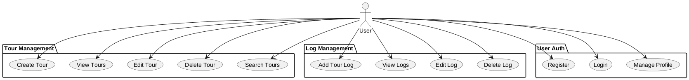
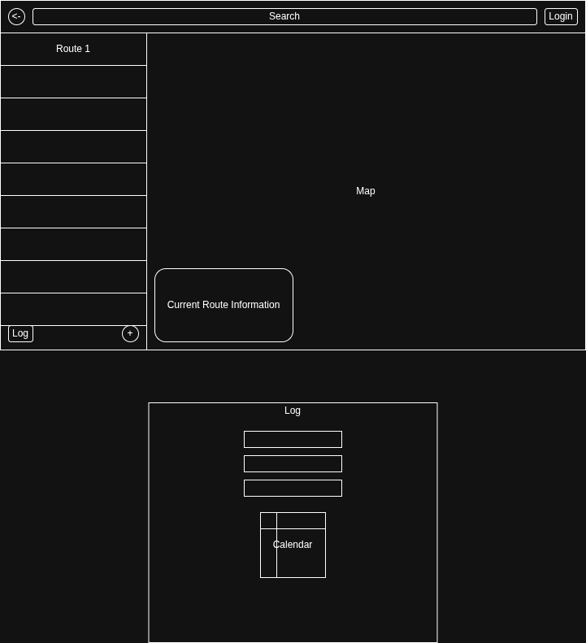

# TourPlanner Protocol

This document provides a summary of the technical decisions, features, and UI-flow for the TourPlanner project.

https://github.com/SWEN2-Routenplaner/SWEN2

## Technical Steps and Decisions

### Architecture & Frameworks
- **Frontend Framework:** Angular (v21) was selected for its robust component-based architecture and modern features like Signals.
- **State Management:** A custom Signal-based store was implemented (e.g., `ToursStore`, `AuthStore`). This provides a reactive way to manage state without the complexity of NgRx.
- **Testing:** `vitest` is used for unit testing, offering better performance and integration with modern JavaScript features compared to Karma.
- **Styling:** Tailwind CSS was integrated for utility-first styling, enabling rapid UI development.

### Design Decisions & Refactoring
- **Routing Structure:** Refactored from a flat structure to a hierarchical one with child routes under `/tours`. This allows for better organization of nested views like tour logs and editing.
- **Folder Organization:** The `tours` component directory was refactored to nest sub-components like `new-tour` and `saved-tours` within a `default` component for better encapsulation.
- **Navbar Refactoring:** The search bar was moved into a separate component to keep the navbar lean and improve modularity.
- **Mobile Support:** Implemented a responsive mobile navigation system to enhance accessibility on small screens.

### Failures and Selected Solutions
- **Invalid Route Access:** Encountered issues when users manually entered URLs for non-existent tour logs. 
    - *Solution:* Implemented guard-like logic in components to redirect users if a resource ID (e.g., `logId`) is not found.
- **Form State Management:** Initial tour creation forms were complex and hard to validate across many fields.
    - *Solution:* Standardized on Angular Reactive Forms with clear validation messages and visual feedback (e.g., changing colors for transport modes).
- **Navigation Complexity:** As more features were added, the navbar became cluttered.
    - *Solution:* Extracted the search feature into its own component and introduced a dedicated mobile navigation view.

## UML Use Case Diagram

See [use-case.puml](./use-case.puml) for the PlantUML source.

## UI-Flow (Wireframes)

The following flow describes the typical user interaction path:

### 1. Authentication Flow
- **Register/Login Page:** User enters credentials.
- **Success:** Redirects to **Home**.

### 2. Main Navigation
- **Navbar:** Provides links to **Home**, **Tours**, and **Profile**.
- **Search Bar:** Integrated into the Navbar for global tour searching.

### 3. Tour Management Flow
- **Home:** Overview and quick links.
- **Tours (Default View):** Shows a list of **Saved Tours** on the left and a **New Tour** form or selected tour details on the right.
- **New Tour:** Form with fields for `From`, `To`, `Transport Mode`, and `Description`. Includes ability to add intermediate stops.
- **Edit Tour:** Opens an edit form for an existing tour.

### 4. Log Management Flow
- **Saved Tour Item:** Click to view logs.
- **Tour Logs View:** Shows a list of logs for the selected tour.
- **Add/Edit Log:** Modal or sub-page to enter log details (date, duration, distance, etc.).

### Wireframe

## Current Project State
The project currently has a functional frontend with state management for tours and authentication. The backend is in its initial setup phase with a basic Spring Boot application.
